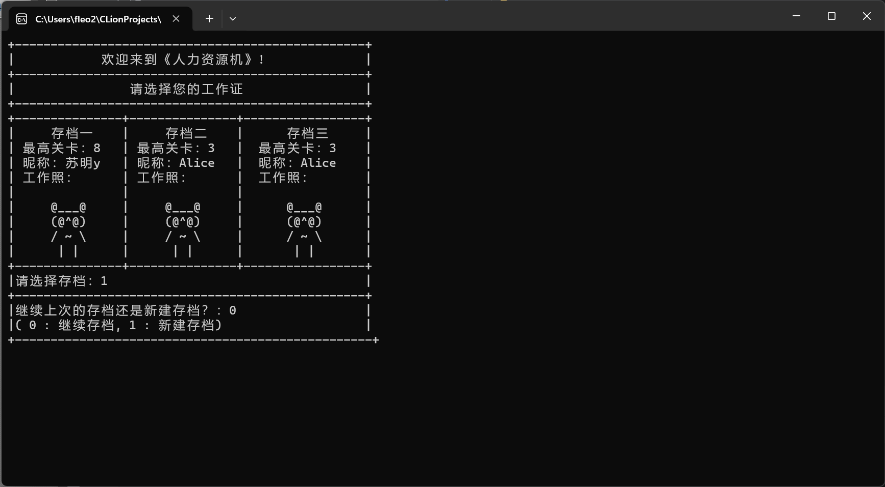
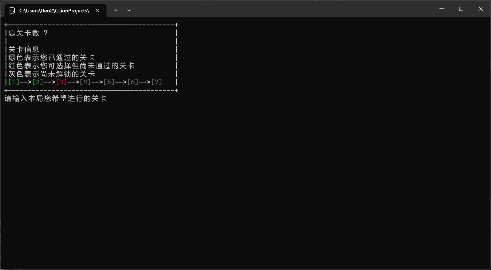
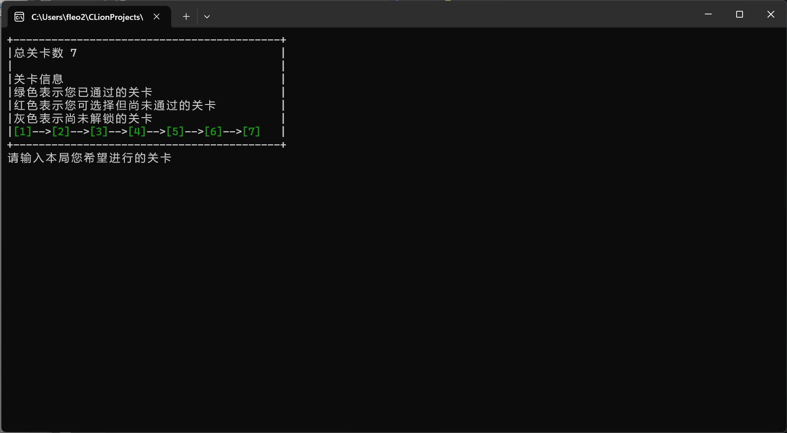
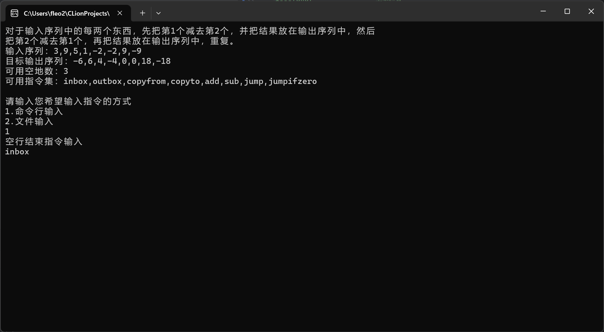
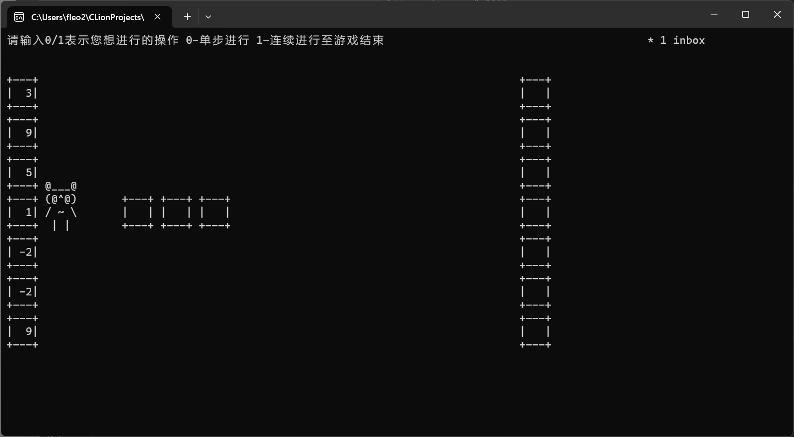
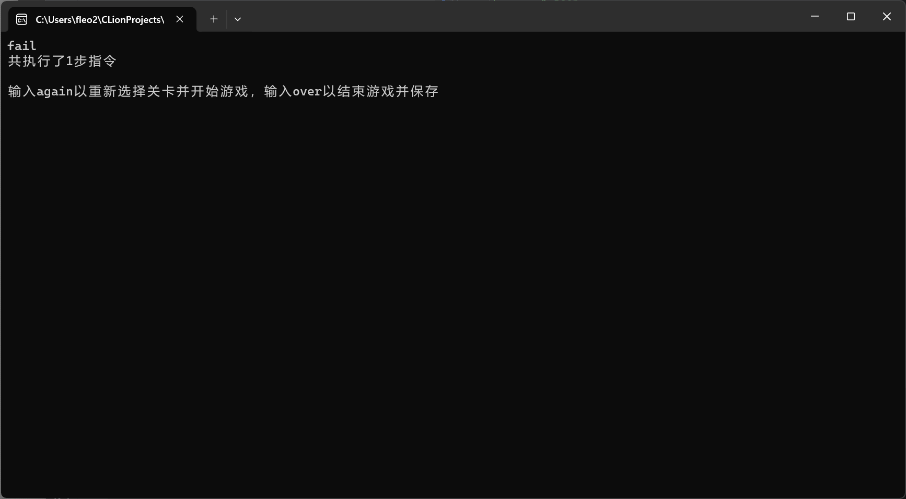
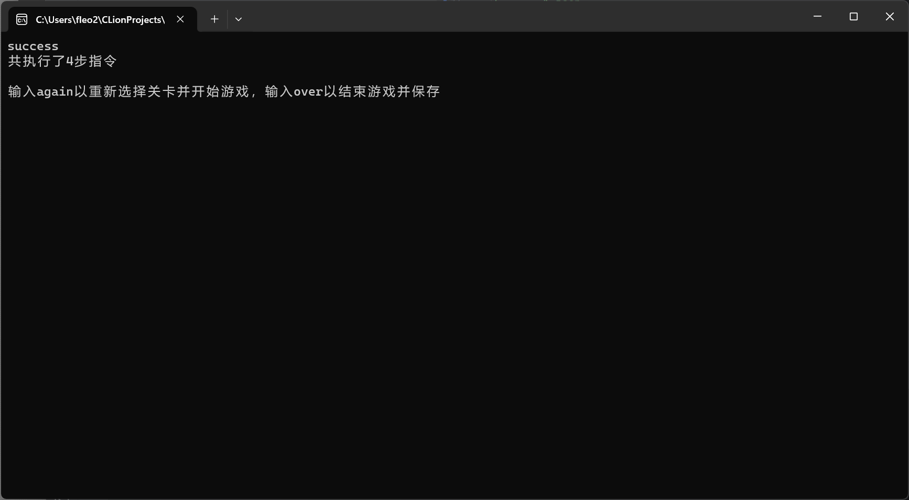

#### 设计思路

##### 主要逻辑

大循环的主要逻辑如下：

首先我们读入本局进行的关卡，为了保证程序具有鲁棒性，采用字符串匹配的方式判断输入。

```C++
std::string level_;
do {
    do {
        std::cout << "请输入本局您希望进行的关卡" << std::endl;
        std::getline(std::cin, level_);
    } while (level_ != std::to_string(atoi(level_.c_str())) or
             std::to_string(record->card[record_id].level) < level_);
} while (std::find(config.begin(), config.end(), level_) == config.end());
clear_screen();
int level = atoi(level_.c_str());
```

接下来我们需要读入对应关卡配置。我们定义了两个匿名函数用于处理读入的逻辑：

```c++
auto readJsonFile = [](const std::string &filename) -> Json::Value {...};
auto read = [&readJsonFile](int level, std::vector<int> &input, std::vector<int> &output, int &ground, std::vector<std::string> &instructions) -> auto {...};
```

并从json文件读入了游戏配置。我们将输入、输出、可用指令保存在列表中。

```c++
// 读入输入输出、地面的大小、可用的指令
auto p = read(level, input, output, ground, available_instructions);
```

对于游戏的运行步骤，主体逻辑很简单，只有一个循环。

```c++
while (!r.finished()) {
        // 执行一步
        r.step();
}
```

即每次执行下一步前判断游戏是否结束，如果结束则退出。

最后，根据退出时的状态输出结束信息。

```c++
if (r.success(output)) {
    std::cout << "success" << std::endl;
    record->card[record_id].level = std::min(std::max(level + 1, record->card[record_id].level),
                                             atoi(config.back().c_str()) + 1);
} else if (r.error_on_instruction()) {
    std::cout << "Error on instruction " << r.pc_ + 1 << std::endl;
} else {
    std::cout << "fail" << std::endl;
}
std::cout << "共执行了" << r.clock << "步指令" << std::endl << std::endl;
```

##### code_manager类：执行游戏逻辑

上面讲述的都是游戏整体的逻辑构成。我们接下来看一看游戏中最核心的逻辑，即如何执行指令、如何判断游戏结束状态。

`code_manager r;` 这是我们用于处理游戏中各种逻辑的类。这里面有一些成员变量。

```c++
class code_manager {
public:
    std::vector<int> input_{};
    std::vector<int> output_{};
    std::vector<int> ground_{};
    std::vector<bool> ground_y{};
    std::vector<InstrSet::instruction *> instruction_{};
    std::vector<std::string> available_instructions{};
    int pc_{};
    int hand_{};
    bool handy = false;
    int clock{};
}
```

从名字即可看出其含义，分别保存了input、output、地面、指令序列，还有记录下一条指令的pc指针。

定义在 `InstruSet` 命名空间中的 `instruction` 类是一个虚类。所有的指令类都从这个类派生得来。

```c++
class instruction {
public:
    int x_;

    explicit instruction(int x = 0) : x_(x) {}

    virtual void print() const = 0;

    virtual std::string to_string() const = 0;


    virtual void accept(std::vector<int> &ground,
                        std::vector<bool> &ground_y,
                        int &hand,
                        std::vector<int> &input,
                        std::vector<int> &output,
                        int &pc, bool &handy) = 0;

    virtual InstrSet::InstrType get_type() const = 0;
};
```

它定义了一些最基本的方法，例如单步执行、输出字符串表示等。

其中，`accept` 函数是核心部分。当执行到一条指令时，只需要调用 `accept` 方法，传入正确的参数即可获得执行后的结果。 

```c++
void step() {
    instruction_[pc_]->accept(ground_, ground_y, hand_, input_, output_, pc_, handy);
    clock++;
}
```

因此，正确重载 `accept` 函数就能定义多条指令的不同操作。**这也给我们添加新指令带来了便利。**

例如，`copyto` 的实现是这样的。

```c++
class copyto : public instruction {
public:
    explicit copyto(int x) : instruction(x) {
    }

    void print() const override {
        std::cout << "copyto" << ' ' << x_ << std::endl;
    }

    [[nodiscard]] std::string to_string() const override {
        return std::string("copyto ") + std::to_string(x_);
    }

    void accept(std::vector<int> &ground,
                std::vector<bool> &ground_y,
                int &hand,
                std::vector<int> &input,
                std::vector<int> &output,
                int &pc, bool &handy) override {
        ground[x_] = hand;
        ground_y[x_] = true;
        pc += 1;
    }

    InstrSet::InstrType get_type() const override {
        return InstrSet::COPYTO;
    }
};
```

最后是一些非核心的功能。`code_manager.add_instruction(s);` 函数负责将字符串s解析为合法的指令。如果指令格式不正确，则解析失败，得到一条非法指令。

```c++
void add_instruction(std::string s) {
    if (s == "inbox") {
        instruction_.push_back(new InstrSet::inbox());
    } else if (s == "outbox") {
        instruction_.push_back(new InstrSet::outbox());
    } else {
        std::istringstream instr(s);
        std::string op;
        std::string x_;
        int x = 0;

        instr >> op;
        std::getline(instr, x_);

        x_.erase(0, x_.find_first_not_of(" "));
        x_.erase(x_.find_last_not_of(" ") + 1);

        if (x_ == std::to_string(atoi(x_.c_str()))) {

            x = atoi(x_.c_str());

        } else {
            instruction_.push_back(new InstrSet::unknown());
            return;
        }
        if (op == "add") {
            instruction_.push_back(new InstrSet::add(x));
        } else if (op == "sub") {
            instruction_.push_back(new InstrSet::sub(x));
        } else if (op == "copyto") {
            instruction_.push_back(new InstrSet::copyto(x));
        } else if (op == "copyfrom") {
            instruction_.push_back(new InstrSet::copyfrom(x));
        } else if (op == "jump") {
            instruction_.push_back(new InstrSet::jump(x));
        } else if (op == "jumpifzero") {
            instruction_.push_back(new InstrSet::jumpifzero(x));
        } else if (op == "jumpifneg") {
            instruction_.push_back(new InstrSet::jumpifneg(x));
        } else {
            instruction_.push_back(new InstrSet::unknown());
        }
    }
}
```

有两种读入指令的方式：从输入和从文件。对于读入的指令，我们首先将其存储在字符串中，然后调用这个函数尝试进行解析。解析成功的指令序列存储在列表中。

##### 绘制图形化界面

每次调用 `r.step()` 只能获得调用后的地面、输入输出等信息。如何将这些信息展示在屏幕上？我们定义了另一个类来完成这个操作。

`Object` 基类是用于输出的最基本的类，它定义了一些基本方法，如设置光标位置、打印函数等。注意 `print(bool clear = false)` 函数中有一个 `clear` 参数，这是用来指定是否清除背景图像的参数。

```c++
class Object {
public:
    int pos_x;
    int pos_y;

    Object(int _x = 0, int _y = 0) {
        pos_x = _x;
        pos_y = _y;
    }

    void move(int _x, int _y) {
        pos_x = _x;
        pos_y = _y;
    }

    void set_cursor(int _x, int _y) {
        // 设置光标位置
        HANDLE hOut;
        COORD pos = {static_cast<SHORT>(_x), static_cast<SHORT>(_y)};
        hOut = GetStdHandle(STD_OUTPUT_HANDLE);
        SetConsoleCursorPosition(hOut, pos);
    }

    virtual void print(bool clear = false) = 0;
};
```

在实际打印时，对于不变的背景图像我们不需要反复打印。

例如，画一个箱子的代码是：

```c++
class Box : public Object {
public:

    int num_;
    bool enable;

    explicit Box(int _x = 0, int _y = 0, int num = 0) : Object(_x, _y), num_(num) {}


    void print(bool clear = false) override {
        HANDLE hConsole = GetStdHandle(STD_OUTPUT_HANDLE);
        CONSOLE_SCREEN_BUFFER_INFO csbi;
        int cursorX = 0, cursorY = 0;
        // 获取光标位置
        if (GetConsoleScreenBufferInfo(hConsole, &csbi)) {
            cursorX = csbi.dwCursorPosition.X;
            cursorY = csbi.dwCursorPosition.Y;
        }
        if (clear == false) {
            // 将光标移动到指定位置并打印机器人
            set_cursor(pos_x, pos_y);
            std::cout << "+---+";
            set_cursor(pos_x, pos_y + 1);
            enable ? std::cout << '|' << std::setw(3) << std::setfill(' ') << num_ << '|' : std::cout << '|' << "   "
                                                                                                      << '|';
            set_cursor(pos_x, pos_y + 2);
            std::cout << "+---+";
        } else {
            set_cursor(pos_x + 1, pos_y + 1);
            enable ? std::cout << std::setw(3) << std::setfill(' ') << num_ : std::cout << "   ";
        }
        // 将光标移动回原来的位置
        set_cursor(cursorX, cursorY);
    }
};
```

有了以上内容，我们绘制屏幕就十分便利。具体来说，我们使用一个类来管理屏幕：

```
class Curtain : public Object
```

这个类接受当前的一个状态向量 `void set_state` ，包含机器人手上的数字、输入输出序列、地面情况、执行指令的情况，然后根据当前序列打印画面中可能会发生变化的部分 `void print(bool clear = false)`。

```c++
void set_state(std::vector<int> &input, std::vector<int> &output, std::vector<int> &ground,
               std::vector<InstrSet::instruction *> instruction, int pc, std::vector<bool> &ground_y) {
    ground_box.clear();
    instruction_box.clear();
    for (auto &box: input_box) {
        box.enable = false;
    }
    for (auto &box: output_box) {
        box.enable = false;
    }
    for (int i = 0; i < std::min(input.size(), input_box.size()); i++) {
        input_box[i].enable = true;
        input_box[i].num_ = input[i];
    }
    for (int i = 0; i < std::min(output.size(), output_box.size()); i++) {
        output_box[i].enable = true;
        output_box[i].num_ = output[output.size() - 1 - i];
    }
    for (int i = 0; i < ground.size(); i++) {
        ground_box.emplace_back(18 + 6 * i, 12, ground[i]);
        ground_box[i].enable = ground_y[i];
    }
    for (int i = 0; i < instruction.size(); i++) {
        instruction_box.emplace_back(100, i, instruction[i]->get_type(), i == pc, instruction[i]->x_, i + 1);
    }
}

void print(bool clear = false) override {
    for (auto &box: input_box) {
        box.print(clear);
    }
    for (auto &box: output_box) {
        box.print(clear);
    }
    for (auto &box: ground_box) {
        box.print(clear);
    }
    for (auto &box: instruction_box) {
        box.print(clear);
    }

}
```

最后就是处理机器人运动的问题了。我们在每次执行之前处理机器人的运动，先读取下一条指令，预判机器人将要去到什么位置，然后按照一定的速度让机器人向正确的方向运动到目的地。

```c++
while (target_x != x or target_y != y) {
    x = (target_x == x) ? x : x + dir_x;
    y = (target_y == y) ? y : y + dir_y;
    clear_rectangle(robot->pos_x, robot->pos_y - 3, robot->pos_x + 4, robot->pos_y + 3);
    robot->move(x, y);
    robot->ingame = r.handy;
    robot->print();
    Sleep(15);
}
```

#### 工程结构

工程结构如图所示，各个部分的内容有：

```
|   .gitignore
|   CMakeLists.txt
|   README.md
+---ans					关卡答案
|       1
|       2
|       3
|       4
|       5
|       6
|       7
|       
+---bin					编译后的二进制文件
|       game.exe
|       
|               
+---include				头文件
|       debug.h			用于debug的头文件
|       hrm_gui.h		绘制图形界面的头文件
|       json-forwards.h	读取json文件
|       json.h			读取json文件
|       utils.h			定义游戏中所有类
|       
+---level				关卡信息
|       1.json
|       2.json
|       3.json
|       4.json
|       5.json
|       6.json
|       7.json
|       
+---record				游戏记录
|       1.rec
|       2.rec
|       3.rec
|       Template.rec
|       
\---src					所有游戏代码
        hrm_gui.cpp		绘制图形界面、执行主体逻辑
        jsoncpp.cpp		读取json文件
        main.cpp		游戏入口
```

##### 整体游戏界面的设计

进入游戏界面：包含选择存档、选择是否新建存档。



选择关卡界面：绿色表示已经通过的关卡，红色表示正在进行中的关卡，灰色表示还没有解锁的关卡。





输入指令界面：每个关卡有详细的指示，包括本关卡的目标、可用的指令、输入输出序列、可用空地。



游戏进行界面：顶部是游戏单步进行和连续执行的对话框，输入0/1表示希望的操作。左、右的箱子为输入和输出序列，中间的箱子为空地。画面最右边还有执行中的指令序列，正在执行的下一条指令前有星号标记。



闯关结果界面





#### 游戏测试


#### 自由创新关卡

##### 利用给定的有限指令实现乘法

对于程序员来说，失去了乘法的手段无疑失去了探索编程世界一半的机会。

为此我们启发玩家在给定的有限的指令上实现乘法运算，为了实现这一点，我们特地将这一关卡（第七关）的每块空地初始化为1，以便玩家可以实现类似于高级语言

```c++
// 为了实现 c = a*b
int c = a;
for(int i=b-1;i > 0; i--)
{
    c += a;
}
```

来实现一个“伪乘法”

我们也在`ans/7`文件中给出了参考做法：

```
inbox
copyto 0
copyto 1
inbox
sub 3
copyto 2
jumpifzero 15
copyfrom 1
add 0
copyto 1
copyfrom 2
sub 3
copyto 2
jump 7
copyfrom 1
outbox
jump 1
```

即利用乘法可以拆分为加法的循环的思想，对于 `a*b`，将 b 个 a 相加即可，可以使用 `jumpifzero` 来实现循环的结构，判断何时 a 已经加了 b 次。

#### 特色功能

我们制作了一个游戏存档功能，能够分别保存三位不同玩家的性别（头像）、名字、闯关进度。同时支持新建玩家与替换原有玩家。

#### 小组分工

胡越舟：游戏主体逻辑和游戏测试

苏明宇：用户界面GUI和关卡设计

#### 编译、运行说明


> Windows 环境下 + 需要安装Mingw工具并添加好环境变量

* 进入项目根目录
* `mkdir build`
* `cd build`
* `cmake .. -G "MinGW Makefiles"`
* `cmake --build .`

即可在bin目录中找到 `game.exe` 可执行文件，在终端打开并执行即可进入游戏

当然也可以使用 vscode 的cmake插件代替复杂的指令自动实现编译的功能